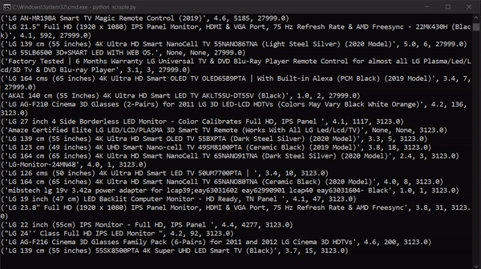

# Amazon Web Scraper         
            

* Here is an Amazon Web Scraper used to extract data from **Amazon** product search page and stores that data into **.csv** file. We just have to enter the name of the product and this script will its job.
* This is a screenshot of .csv file.
    * 

## Features

* From each page it extracts each and every product following information:   
    1. Product name
    1. Product rating
    1. Number of reviews
    1. Product price
* GIF of how data extraction takes place
    * 

## Overview

* With the help of python script data scraping is done in this project. Python BeautifulSoup library does the major role in it. Along with that selenium package is also used. You can check entire code in scraple.py
* Csv package is used to store all the extracted data into Amazon.csv file.
* Requirements for this project is mentioned in requirements.txt file. 

